<div align="center">

# Purchase Requisition Approval & Supplier Risk

**The same S/4HANA requirement, built twice: on-stack with ABAP Cloud / RAP and
side-by-side with SAP CAP on BTP. Plus a written comparison of when to choose
which.**


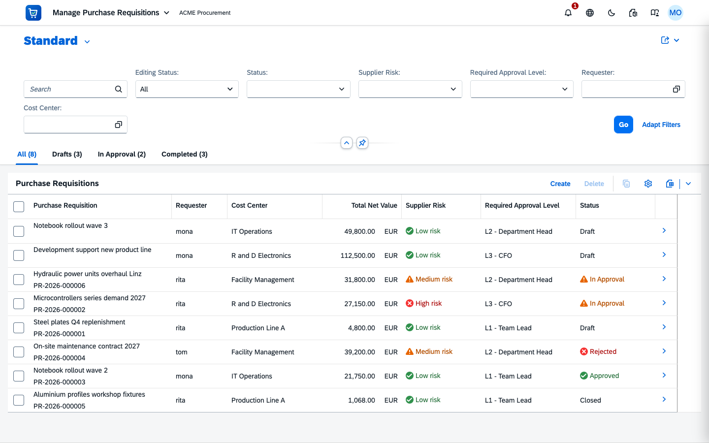

<table>
<tr>
<td width="50%">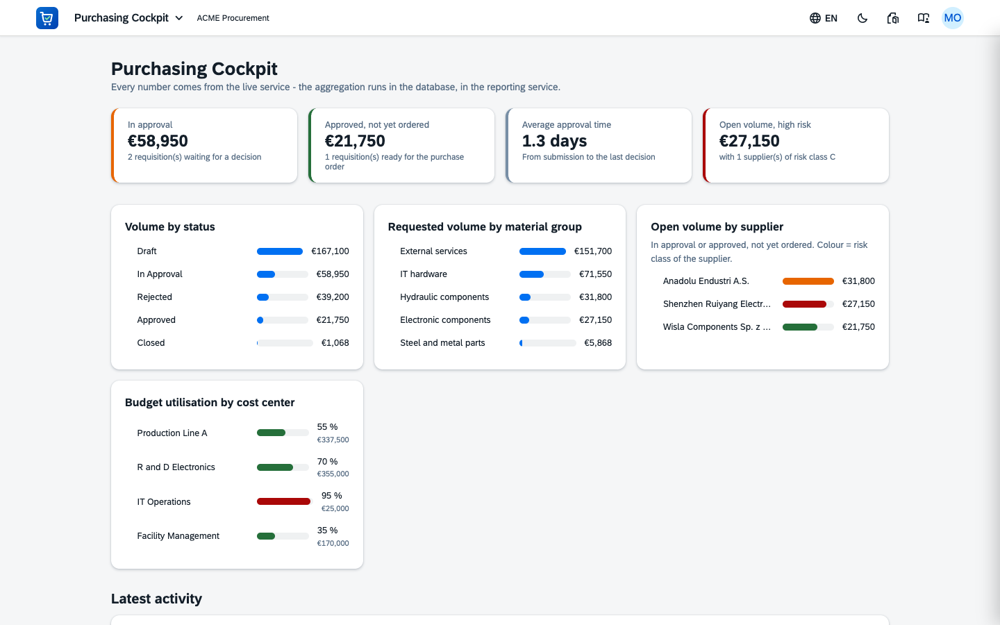<br><sub><b>Purchasing cockpit</b> — volume, risk exposure, budget, live from the service</sub></td>
<td width="50%">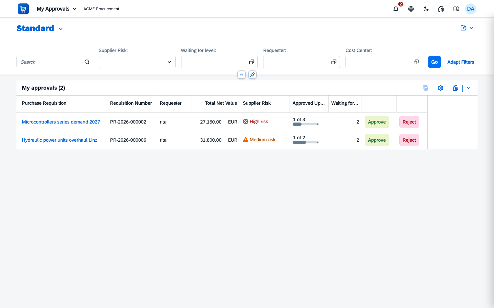<br><sub><b>Approver inbox</b> — only what waits for your level, decided in the row</sub></td>
</tr>
<tr>
<td width="50%">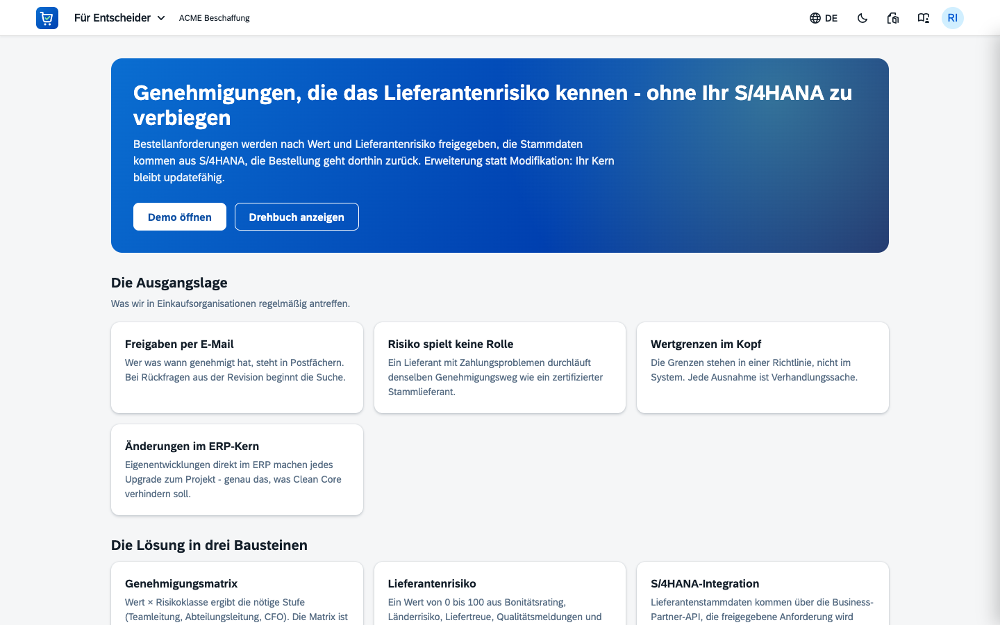<br><sub><b>For decision makers</b> — the business case, with a calculator that uses your numbers</sub></td>
<td width="50%">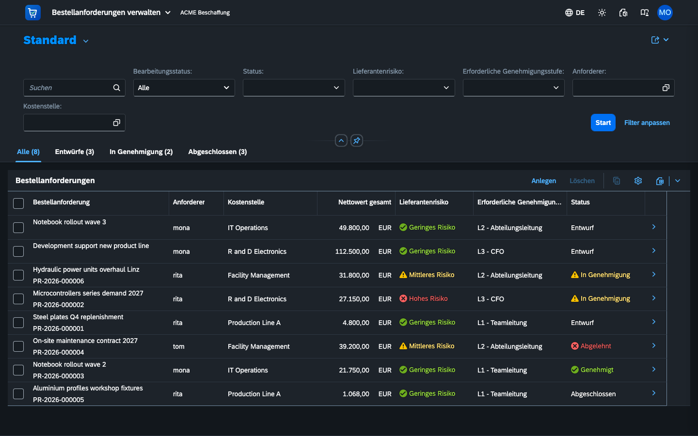<br><sub><b>German or English, light or dark</b> — labels, code lists and errors come localized from the server</sub></td>
</tr>
</table>

</div>

Every SAP customer is asking the Clean Core question right now, and most answers
are slide decks. This repository answers it with two working implementations and
a decision record that names the trade-offs.

**Contents:**
[Scenario](#the-scenario) ·
[Run it](#run-it) ·
[Tour of the UI](#a-tour-of-the-ui) ·
[S/4HANA integration](#the-s4hana-integration) ·
[Demo mode](#demo-mode-for-presenting-it) ·
[Security & operations](#security-and-operations) ·
[What is SAP in here](#what-in-here-is-sap) ·
[Repository](#whats-in-the-repository) ·
[Design decision](#the-structural-decision-behind-both) ·
[Details](#six-details-worth-a-minute) ·
[Built with AI](#built-with-ai-in-the-loop) ·
[Scope](#scope-stated-plainly) ·
[License](#license-and-contributions)

---

## The scenario

Procurement at a mid-size manufacturer. A requester raises a purchase
requisition. How many signatures it needs depends on its **value** and on how
**risky its suppliers** are. When the rating agency downgrades a supplier, every
open requisition that uses it immediately becomes more expensive to approve.

That second half is what makes the scenario worth building: master data and
transactional data have to interact, and that's where extension projects
actually get hard.

| Net value (EUR) | Risk A | Risk B | Risk C |
|---|:---:|:---:|:---:|
| below 5,000 | L1 | L1 | **L2** |
| 5,000 – 24,999 | L1 | **L2** | L2 |
| 25,000 – 99,999 | L2 | L2 | **L3** |
| 100,000 and above | L3 | L3 | L3 |

L1 = Team Lead · L2 = Department Head · L3 = CFO.
The full rule set is in [`docs/business-rules.md`](docs/business-rules.md).

---

## Run it

Requires Node.js 20 or later.

```bash
cd cap
npm install
npm start
```

Open **<http://localhost:4004>**. The demo signs you in as the requester
`rita`; the user menu in the header switches to any other demo user with one
click. A short onboarding tour starts on your first visit, and the **demo
script** in the header walks through the whole story in ten steps.

| User | Roles | Try this |
|---|---|---|
| `rita` | Requester | Create a requisition and submit it |
| `tom` | Requester, Approver L1 | Approve level 1 of `PR-2026-000002` |
| `dana` | Requester, Approver L1 + L2 | Approve up to level 2 |
| `carl` | Approver L1 + L2 + L3 (CFO) | Give the final approval on a high-risk requisition |
| `mona` | Procurement Admin, Requester | Recalculate supplier risk scores |

Nobody may approve their own requisition. The UI is German by default and
switches to English through the globe in the header.

<details>
<summary><b>Direct links and developer commands</b></summary>

| Page | URL |
|---|---|
| Start page | <http://localhost:4004/> |
| For decision makers | <http://localhost:4004/solution.html> |
| Purchasing cockpit | <http://localhost:4004/cockpit.html> |
| Manage Purchase Requisitions | <http://localhost:4004/purchase-requisitions/webapp/index.html> |
| My Approvals (approver inbox) | <http://localhost:4004/approvals/webapp/index.html> |
| Supplier Risk | <http://localhost:4004/suppliers/webapp/index.html> |
| OData V4 service | <http://localhost:4004/procurement/> |
| Reporting service | <http://localhost:4004/analytics/> |
| Mocked S/4HANA APIs | <http://localhost:4004/odata/v4/api-business-partner/> |

```bash
npm test           # 261 tests, type checked as they run
npm run typecheck
npm run lint       # ESLint with type aware rules
npm run build      # production build: cds build + tsc to gen/srv
npm run types      # regenerate the model types for your editor
npm run watch      # restart on every change
npm run start:sandbox   # supplier sync against the SAP API Business Hub sandbox
npm run check:i18n      # every text exists in German and English
npm run screenshots     # regenerate docs/images from the running app
```

The SAPUI5 runtime is loaded from `ui5.sap.com`, so the browser needs internet
access. The service itself runs offline on an in-memory SQLite database.

</details>

---

## A tour of the UI

All screenshots come from the running application with the sample data from
`cap/db/data`.

### Manage Purchase Requisitions: list report


The worklist: tabs by lifecycle stage with live counts, dropdown filters, and one
row per requisition with its net value, the worst supplier risk in the document
and the approval level that follows from the two.

**Nothing on this screen is computed in the UI.** The status colour comes from
`status.criticality` in the code list. The risk class is derived from the item
suppliers, and the required level falls out of the approval matrix. All of it
happens server side and is covered by tests. There is no hand-written UI5 code
in the apps: columns, filters, tabs and buttons are generated by SAP Fiori
Elements from the CDS annotations in
[`cap/app/purchase-requisitions/annotations.cds`](cap/app/purchase-requisitions/annotations.cds).

### My Approvals: the approver inbox


Every approver sees exactly what is waiting for **their** level, and decides in
the row. The filter is not a UI convenience: the before-READ handler pushes the
pending level, the roles of the caller and segregation of duties into the
database query, so a requisition someone raised themselves can never appear in
their own inbox. The title links into the requisition when more context is
needed.

### Purchase requisition: object page

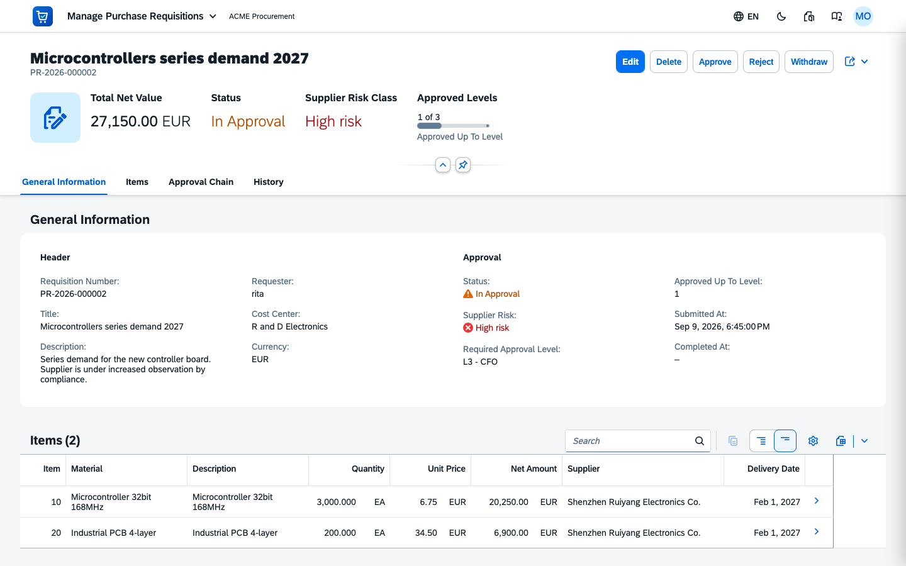

One requisition for 27,150 EUR from a high-risk supplier. The header shows four
key figures, and the buttons in the title bar hide themselves unless the
current status allows them. So the UI never offers something the service would
reject, and the service still checks every call anyway.

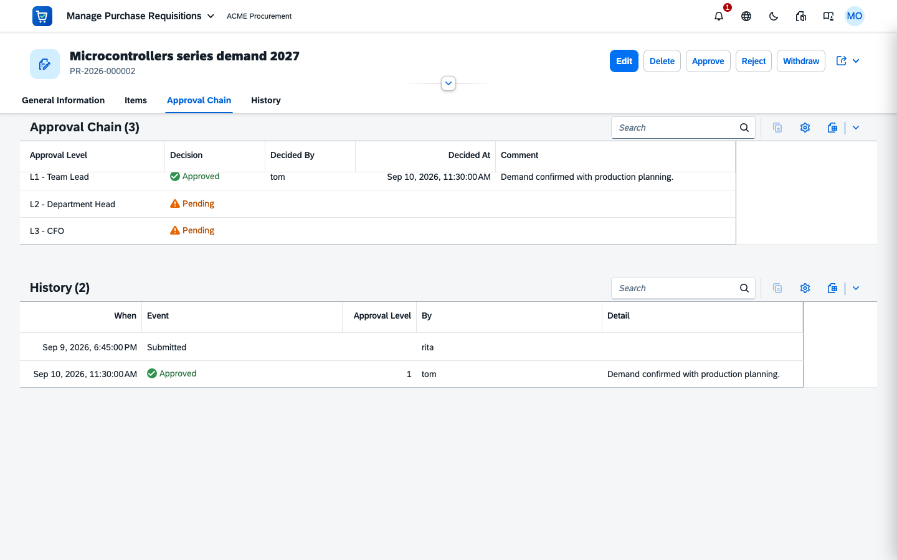

The approval chain is **created in full on submit**, so all three levels are
visible from the start rather than appearing one at a time. It has three levels
because 27,150 EUR sits in the 25k–100k tier *and* the supplier is risk class C.
The L1 comment is what the approver typed into the bound action.

Edit an item and the header updates itself: a `@Common.SideEffects` annotation
tells the client that `quantity` and `unitPrice` affect `totalValue` and
`requiredApprovalLevel`, and a determination on the server actually recomputes
them. Raise the quantity far enough and the chain grows a level while you watch.

The **history** tab holds the complete audit trail: submitted, approved,
rejected, ordered - and the adjustments nobody clicked, such as an approval
path that grew because a supplier was downgraded while the requisition was in
approval.

### Supplier Risk

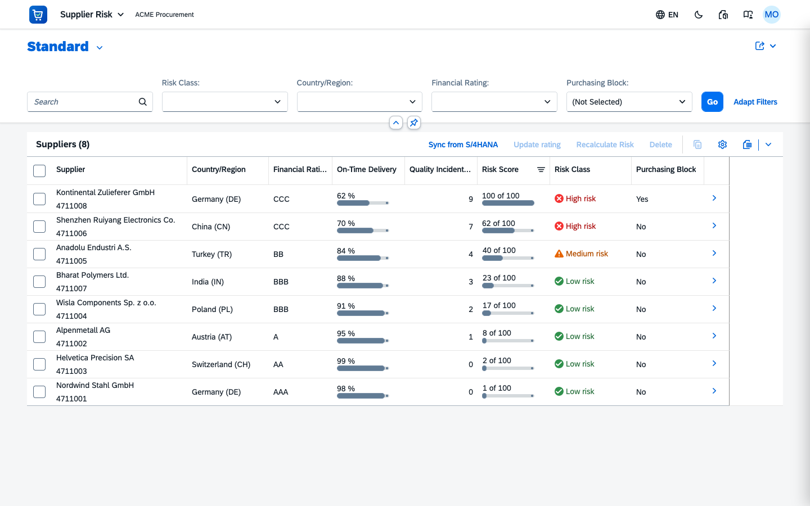

The supplier master with the risk indicators and the resulting score, sorted
worst first. The bar thresholds (yellow from 25, red from 55) are the same
constants the scoring module uses: `RISK_CLASS_THRESHOLDS` in
`cap/srv/lib/risk-scoring.ts`, mirrored in `ZCL_PR_RISK_SCORING`. The blocked
supplier at the top scores 100 regardless of its other indicators, and a
requisition that uses it cannot be submitted at all (`PR005`).

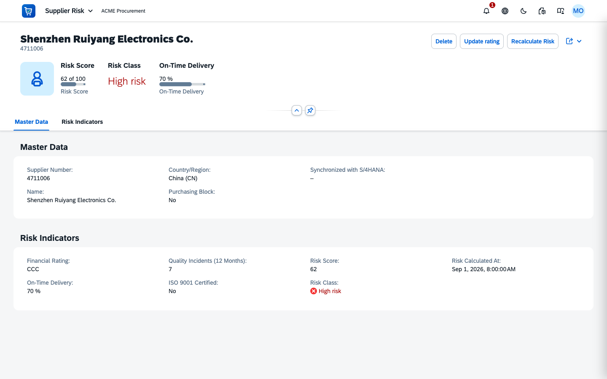

`Recalculate Risk` is a bound action restricted to `ProcurementAdmin`. The
unbound `recalculateAllSupplierRisks` is the entry point for the nightly job and
reports how many scores actually changed.

### Onboarding tour

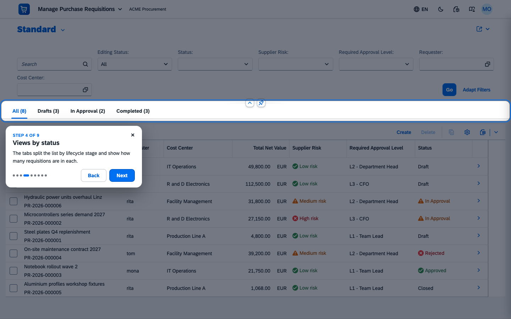

On the first visit of each page, a short tour walks through it: filters, status
tabs, what the colours mean, which user can do what, and on the object page the
approval chain. It's available in both languages, you can navigate it with the
arrow keys, and the book icon in the header restarts it at any time. The steps
point at the stable IDs Fiori Elements derives from the annotations
(`fe::FilterBar::…`, `fe::table::…`). A step whose element is missing falls back
to a centred card, so the tour degrades instead of breaking.

### Purchasing cockpit


Volume in approval, approved but not yet ordered, average approval time and the
open volume with high-risk suppliers - plus volume by status and material
group, exposure per supplier coloured by risk class, and budget utilisation per
cost center. The aggregations run in the database as CDS views
(`cap/srv/analytics-service.cds`); the page only draws them.

### For decision makers


The business case in one page: situation, the solution in three parts, the
process, what it is worth, the honest on-stack vs side-by-side comparison and
an example project plan.

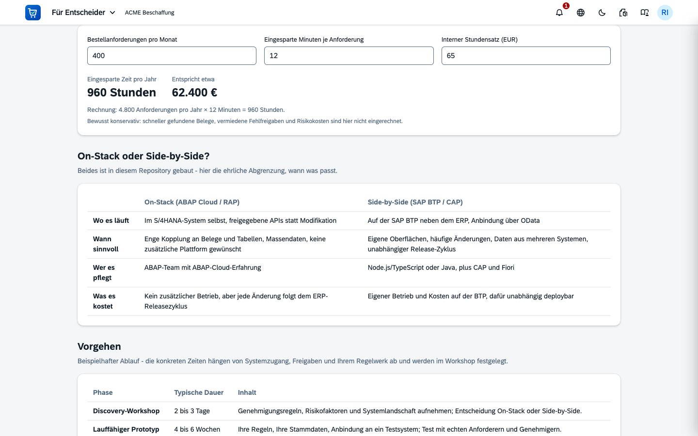

The calculator ships **no industry averages**. It computes with the numbers the
reader types in and prints the formula underneath - the only claim it makes is
arithmetic.

### Approval rules, maintained in Excel

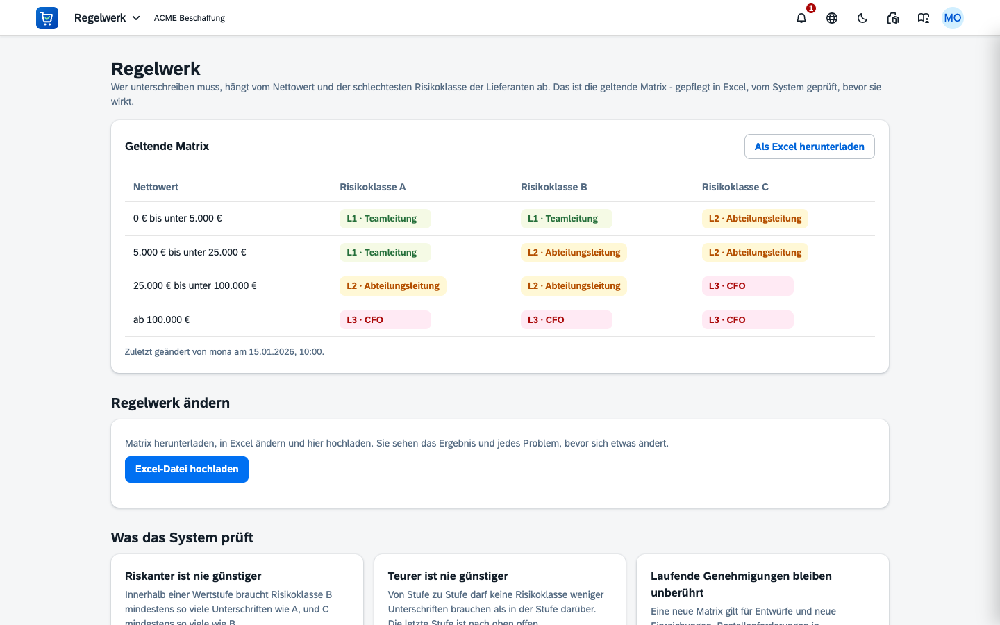

The approval matrix is no longer a constant a developer has to change. The
procurement admin downloads it as Excel, edits it, uploads it - and sees a
preview with every problem and its row number before anything changes. A
matrix that would make a riskier or a more expensive requisition cheaper to
approve cannot be activated: the same two properties the unit tests assert for
the built-in matrix are now checks a maintained one has to pass. Requisitions
already in approval keep their path ([ADR 0011](docs/adr/0011-maintained-approval-matrix.md)).

### Notifications

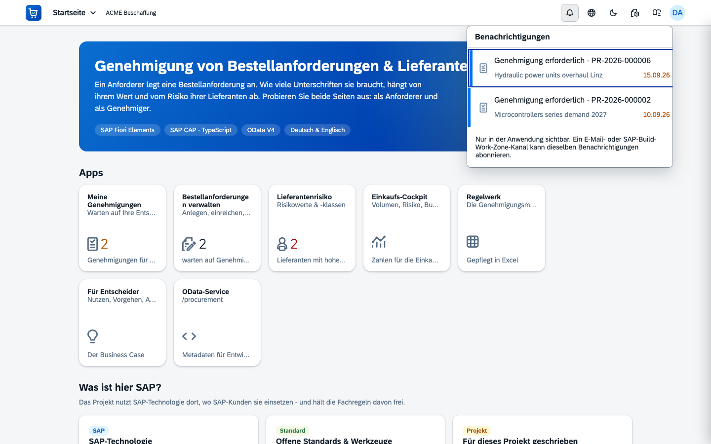

Approval requests go to the **role** of the pending level - the identity
provider knows who holds it, the application keeps no copy of that list.
Outcomes (approved, rejected, ordered, approval path adjusted) go to the
requester by name. Nobody is ever asked to approve their own requisition. The
bell shows them in the app; every notification is also emitted as the event
`NotificationCreated`, the seam for mail or SAP Build Work Zone
([ADR 0010](docs/adr/0010-notifications-to-roles-in-app-first.md)).

### On the phone

<table>
<tr>
<td width="50%">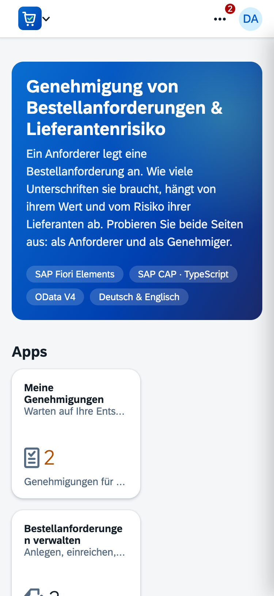</td>
<td width="50%">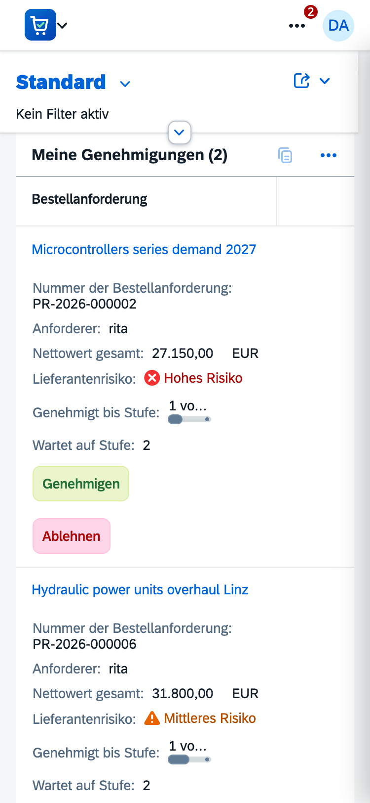</td>
</tr>
</table>

Approving from the phone is what approvers actually do. The inbox keeps its
approve and reject buttons at 375 px, the header bar folds language, theme,
tour, demo script and notifications into its overflow menu, and every page was
checked at phone width - not assumed to be responsive.

### German and English, light and dark


The globe in the header switches between **Deutsch** and **English**. It's not
just a UI translation: CAP answers in the request language, so field labels in
`$metadata`, code list texts ("In Genehmigung", "Hohes Risiko") and **server
error messages** all arrive localized, while message codes such as `PR009` stay
the same in every language.

| Where | What |
|---|---|
| [`cap/_i18n/i18n*.properties`](cap/_i18n) | Labels referenced by the annotations as `{i18n>Key}` |
| [`cap/_i18n/messages*.properties`](cap/_i18n) | Server messages, keyed per rule with `{0}` placeholders |
| `cap/db/data/*_texts.csv` | Localized code lists (status, risk class, approval level, countries, …) |
| [`cap/app/shared/i18n`](cap/app/shared/i18n) | Header bar, start page and onboarding tour |

A test checks that every English server message has a German counterpart with
the same placeholders. The sun/moon button switches between the light and dark
variants of SAP Horizon.

### Who am I?

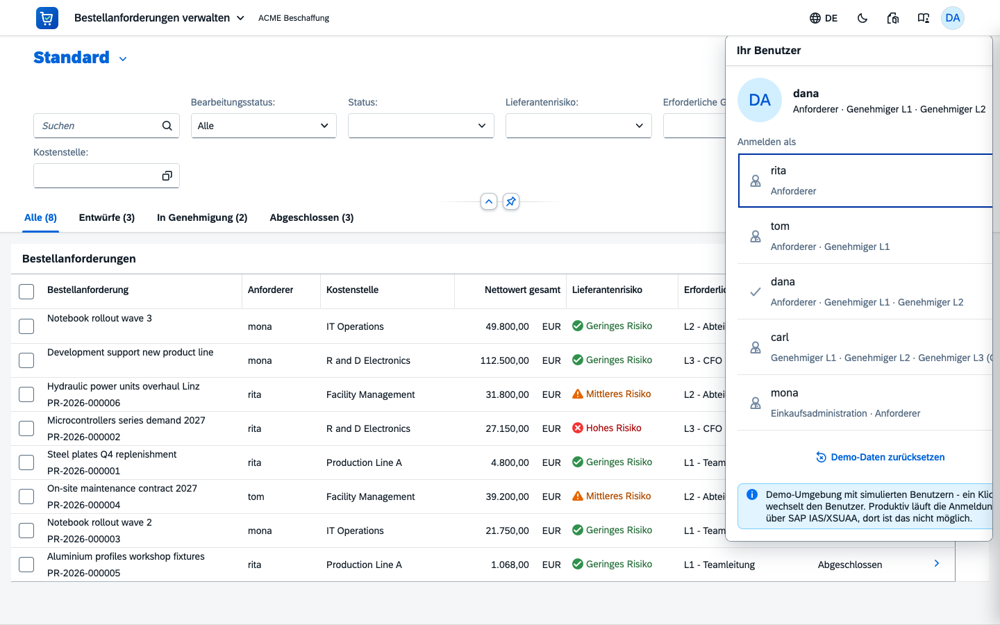

The avatar shows the signed-in user and their roles, read from the
`currentUser()` function of the service. The UI never decides anything based
on it. It's there so a first-time visitor understands why `tom` can approve
and `rita` can't.

---

## The S/4HANA integration

Supplier master data comes **from** S/4HANA, purchase orders go **to** it -
both through released A2X OData APIs, modelled as CAP remote services:

| Direction | Service | What happens |
|---|---|---|
| In | `API_BUSINESS_PARTNER` | `Sync from S/4HANA` takes over name, country and purchasing block of every supplier, creates the ones that are new there, and recalculates the risk of everything that changed. |
| Out | `API_PURCHASEORDER_PROCESS_SRV` | `Create purchase order` turns an approved requisition into one purchase order per supplier and writes the numbers back onto the requisition and its items. |

Who owns what is explicit: S/4HANA owns name, country and purchasing block; the
risk attributes (rating, delivery performance, incidents, certification) belong
to this application and a sync never overwrites them.

Which system answers is configuration, not code:

```bash
npm start              # both APIs mocked in-process from srv/external/data
npm run start:sandbox  # supplier sync against the SAP API Business Hub sandbox
```

In production the same services resolve to a BTP destination (`S4HANA`). The
mapping itself - what becomes a purchase order item, what a sync changes - is a
pure module with unit tests (`cap/srv/lib/s4-mapping.ts`), and the integration
tests run against the mocked services over HTTP. Details and the honest limits
are in [ADR 0009](docs/adr/0009-s4-integration-via-released-apis.md).

**The demo moment:** downgrade a supplier's rating (or let the sync bring a
purchasing block from S/4HANA) and every open requisition that uses it is
re-derived on the spot - the approval path grows a level, the requisition
in approval gains a pending step, and the history says why
([ADR 0008](docs/adr/0008-risk-changes-never-shorten-the-path.md)).

---

## Demo mode, for presenting it

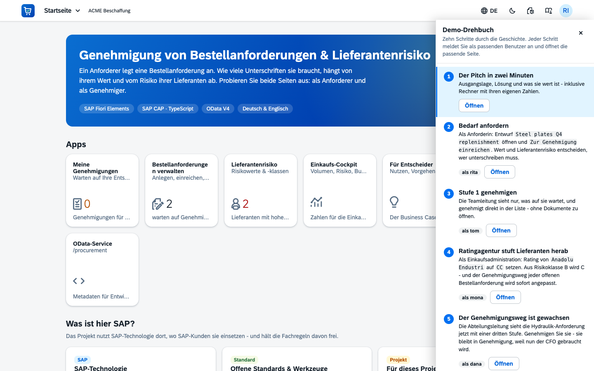

Presenting an approval process means switching roles constantly. The header has
a **demo script**: ten steps through the whole story, each one signing you in as
the right user and opening the right page - requester, team lead, procurement
admin downgrading a supplier, department head, CFO, purchase order, S/4HANA
sync, cockpit, reset.


The user menu switches users with one click and restores the sample data.

**None of this can happen in a productive landscape.** The switch writes a
cookie that `cap/srv/demo-mode.ts` turns into mocked credentials before CAP's
own authentication runs, and both the cookie and `DemoService` are inert unless
`cds.requires.auth.kind` is `mocked` or `basic`. With XSUAA or IAS the service
answers `403`.

---

## Security and operations

The questions an IT lead asks, answered in
[`docs/security-and-operations.md`](docs/security-and-operations.md) - each
with the file that makes it true:

| | |
|---|---|
| **Authentication** | XSUAA in production; the demo user switch is inert without mocked auth |
| **Authorization** | five role collections; static, instance-based (in the database query) and in-rule checks - none trusts the UI |
| **Personal data** | user IDs only, annotated with `@PersonalData` for the SAP audit log |
| **Integration** | BTP destination service in `mta.yaml`, credentials in the cockpit, never in the repository |
| **Monitoring** | `GET /health`, structured CAP logs, a business audit trail per requisition |
| **Supply chain** | `npm audit` in CI - the build fails on a known vulnerability |

The same document lists what is **not** done yet: technical audit logging,
retention rules, centralised logging, a penetration test.

---

## What in here is SAP?

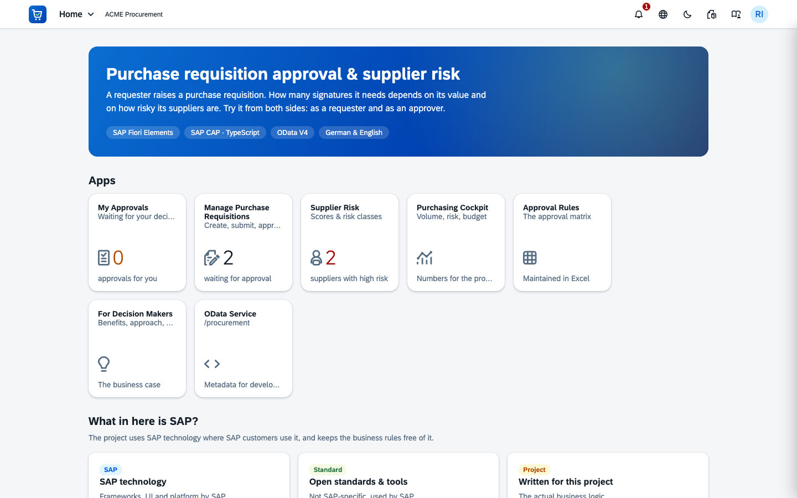

If you're coming from outside the SAP world, this is the map:

| | Part | What it does here |
|---|---|---|
| **SAP** | [SAP Cloud Application Programming Model (CAP)](https://cap.cloud.sap), `@sap/cds` | Data model, OData service, authorization, draft handling, i18n |
| **SAP** | SAPUI5 with **SAP Fiori Elements** | Generates the entire UI from annotations; loaded from `ui5.sap.com` |
| **SAP** | SAP Fiori design: Horizon theme, ShellBar, tiles | Look and feel of the start page and the apps |
| **SAP** | S/4HANA A2X APIs: `API_BUSINESS_PARTNER`, `API_PURCHASEORDER_PROCESS_SRV` | Supplier master data in, purchase orders out - mocked locally |
| **SAP** | SAP BTP: `mta.yaml`, XSUAA (`xs-security.json`), SAP HANA Cloud | Production deployment (not needed to run locally) |
| **SAP** | ABAP Cloud / RAP in [`abap/`](abap/) | The same business object inside S/4HANA, needs an SAP system |
| Standard | OData V4 (OASIS) | The REST protocol between UI and service |
| Standard | SQLite, Node.js, TypeScript, Jest, ESLint | Local database, runtime and tooling |
| This project | [`cap/srv/lib`](cap/srv/lib) | Approval matrix and risk scoring, with no framework imports |
| This project | `cap/db`, `cap/app/*/annotations.cds`, `cap/_i18n` | Domain model, sample data, UI annotations, translations |
| This project | [`cap/app/shared`](cap/app/shared) | Start page, cockpit, decision maker page, header bar, language and theme switch, tour, demo script |

The same map is on the start page of the running application.

---

## What's in the repository

```
.
├── cap/        SAP CAP service (TypeScript), runnable, tested, deployable
│   ├── db/         domain model, code lists, sample data (+ German texts)
│   ├── srv/        services, rule modules, S/4HANA remote services, demo mode
│   ├── app/        three Fiori Elements apps + start page, cockpit,
│   │               decision maker page, shell, tour and demo script
│   ├── _i18n/      labels and server messages, English and German
│   └── test/       261 tests
├── abap/       ABAP Cloud / RAP implementation of the same business object
│   └── src/        tables, CDS views, behaviour definitions, classes, 51 ABAP Unit tests
├── docs/       architecture, domain model, business rules, 11 ADRs, demo script
├── scripts/    translation check, screenshot generation, the file size hook
├── .claude/    conventions, skills and commands for working with Claude Code
├── CLAUDE.md   the rules a change in this repository has to follow
└── LICENSE     MIT
```

---

## The structural decision behind both

**Business rules live in classes that know nothing about the framework.**

| | on-stack | side-by-side |
|---|---|---|
| Rules | `ZCL_PR_APPROVAL_POLICY`, `ZCL_PR_RISK_SCORING` | `srv/lib/approval-policy.ts`, `srv/lib/risk-scoring.ts` |
| Plumbing | behaviour pool `ZBP_I_PR_REQUISITION` | `srv/procurement-service.ts` |
| Rule tests | 51 ABAP Unit, no database | 164 Jest, no database |

A rule class contains no `SELECT`, no `req` and no `MODIFY ENTITIES`. It takes
plain structures and returns plain findings. Three things follow. The tests
actually get written and run in a second. The approval matrix is a table a
procurement lead can read. And the two implementations become comparable line
by line, which turns [ADR 0001](docs/adr/0001-onstack-vs-sidebyside.md) from an
opinion into evidence.

---

## Where to look

| If you want to see | Open |
|---|---|
| Whether I can reason about architecture | [`docs/adr/`](docs/adr/): eleven decisions with their costs |
| Whether the business logic is any good | [`cap/srv/lib/approval-policy.ts`](cap/srv/lib/approval-policy.ts) |
| Whether I can write RAP | [`abap/src/behavior/zi_pr_requisition.bdef.asbdef`](abap/src/behavior/zi_pr_requisition.bdef.asbdef) |
| How far annotations carry a Fiori UI | [`cap/app/purchase-requisitions/annotations.cds`](cap/app/purchase-requisitions/annotations.cds) |
| Whether I test properly | [`docs/testing.md`](docs/testing.md) |
| How I integrate with S/4HANA | [`cap/srv/lib/s4-mapping.ts`](cap/srv/lib/s4-mapping.ts), [ADR 0009](docs/adr/0009-s4-integration-via-released-apis.md) |
| How I would sell this to a customer | <http://localhost:4004/solution.html> once it runs |
| How I work with AI without lowering the bar | [`docs/ai-assisted-development.md`](docs/ai-assisted-development.md) |
| Whether it is safe to run | [`docs/security-and-operations.md`](docs/security-and-operations.md) |
| How I set up CAP with TypeScript | [ADR 0007](docs/adr/0007-typescript.md) |
| Whether it actually runs | [`docs/demo-walkthrough.md`](docs/demo-walkthrough.md) |
| A specific SAP skill | [`docs/skills-matrix.md`](docs/skills-matrix.md) |
| How I would present this | [`docs/demo-script.md`](docs/demo-script.md) |

---

## Six details worth a minute

**Draft events are different events.** In CAP, editing a draft fires `NEW` and
`PATCH` on the `.drafts` entity, not `CREATE`/`UPDATE` on the active one. A
determination registered only on the latter compiles, passes the API tests, and
does nothing at all in the Fiori object page. That bug happened during
development; the test `draft handling > walks create -> add item -> activate`
exists because of it. [ADR 0003](docs/adr/0003-draft-handling.md)

**A type system does not make money safe.** TypeScript's `number` is an IEEE 754
double, so `24999.999999999996` is an ordinary result of a floating point
multiplication and lands on the wrong side of a `< 25000` threshold. Roughly
one requisition in a thousand silently takes the cheaper approval path. Every
amount comparison on the CAP side goes through integer cents. On the ABAP side
that helper does not exist, because packed numbers are exact, and that asymmetry
is documented so nobody adds it "for consistency".
[ADR 0004](docs/adr/0004-money-handling.md)

**A TypeScript service that silently has no handlers.** CAP only looks for a
`.ts` service implementation when `CDS_TYPESCRIPT` is set
(`@sap/cds/lib/srv/factory.js`). Without it the service starts, serves the
model, and answers `501` for every action. No compiler and no linter can see
this. This project's own `npm start` fell for it: the list reports rendered and
every button failed, while all tests stayed green because the test setup sets
the flag. `npm start` now runs `cds-tsx serve`.
[ADR 0007](docs/adr/0007-typescript.md)

**A risk change may tighten an approval, never shorten it.** When a supplier is
downgraded, open requisitions get the levels they now need - appended to the
chain, with the signatures already given left intact. When a supplier gets
*safer*, a requisition that is already in approval keeps its path: an approver
who has been asked is not silently removed because a rating improved an hour
later. That asymmetry is a decision, not an omission, and it is written down in
[ADR 0008](docs/adr/0008-risk-changes-never-shorten-the-path.md).

**Segregation of duties is a business rule, not a permission.** An approver may
well hold the right role, just not for a document they raised themselves. The
check sits in the rule module next to the approval matrix, not in the
authorization layer. It is the first thing an auditor asks about.

**Translations are part of the contract, not of the UI.** Labels, code list texts
and error messages are resolved by the service per request language, so a
German Fiori app, an English API client and a test all see the same codes with
different texts. The rule modules still produce English text for logs and tests;
what the user reads is looked up by message key.

---

## Built with AI in the loop

Claude Code is part of how this repository is written, and the setup for it is
**in the repository**, not in someone's head:

| | What it is |
|---|---|
| [`CLAUDE.md`](CLAUDE.md) | The conventions every session starts with: max. 1000 lines per file, rules that know no framework, both languages for every text, the definition of done. |
| [`.claude/skills/`](.claude/skills) | Four skills carrying the knowledge that is otherwise learned by breaking something: changing a business rule across both stacks, the two Fiori Elements traps, adding an S/4HANA API, regenerating the screenshots. |
| [`.claude/commands/`](.claude/commands) | `/verify` (every quality gate), `/screenshots`, `/demo-check` (walks the ten demo steps against the running service). |
| [`scripts/check-file-length.sh`](scripts/check-file-length.sh) | A write hook that flags a file crossing 1000 lines - which is why the service implementation is split into the lifecycle, the S/4HANA handlers and the shared helpers. |
| [`scripts/check-i18n.mjs`](scripts/check-i18n.mjs) | Compares every English key with its German counterpart, placeholders included. Runs in CI. |

The point is not that AI was involved. It is that the conventions are **checked
by a machine instead of remembered**, and that everything not proven is written
down as such. [`docs/ai-assisted-development.md`](docs/ai-assisted-development.md)
has the whole setup and the honest limits.

---

## Scope, stated plainly

- The **CAP implementation runs and is tested on every commit.** Type
  generation, `tsc --noEmit`, type aware linting, a CDS compile, 261 tests with
  a coverage floor, and a production build that must actually emit the compiled
  service are all enforced by [CI](.github/workflows/ci.yml).
- **TypeScript is pinned to 6.0.3, not the latest 7.0.2.** `ts-jest` supports
  `<7` and `typescript-eslint` supports `<6.1`, so 6.0.3 is the newest version
  the whole toolchain carries. `npm outdated` will keep flagging it; that is the
  correct state, and the reasoning is in
  [ADR 0007](docs/adr/0007-typescript.md).
- **The S/4HANA integration has never met a real S/4HANA.** It is written
  against the published field names of the two released APIs and tested against
  CAP's in-process mocks; the API Business Hub sandbox answers reads, not
  writes. The first run against a real tenant will need a round of fixes -
  typically authorizations, purchasing organisation data and number ranges -
  and that is stated in [ADR 0009](docs/adr/0009-s4-integration-via-released-apis.md)
  rather than discovered on a call.
- **Approver inbox, audit trail, risk propagation and the S/4HANA integration
  exist on the CAP side only.** The customer facing demo runs side-by-side; the
  ABAP package implements the same rules 1 to 6 with the same message numbers.
  The gap is listed in [`docs/business-rules.md`](docs/business-rules.md) and in
  [`abap/README.md`](abap/README.md) instead of being implied away.
- **Notifications do not leave the application.** They are stored, shown in
  the bell and emitted as an event; no mail is sent. Connecting a channel is a
  subscriber, not a change to the approval logic ([ADR 0010](docs/adr/0010-notifications-to-roles-in-app-first.md)).
- **The maintained approval matrix has no history.** The table records who
  changed it last; which matrix was in force on a given date is not kept
  ([ADR 0011](docs/adr/0011-maintained-approval-matrix.md)).
- **Demo mode is a demo feature.** One-click user switching and `resetData` only
  work where authentication is mocked; with XSUAA or IAS both are inert. That is
  enforced in `cap/srv/demo-mode.ts`, not left to discipline.
- The **ABAP package is written for review, not for a one-click import.** There
  is no ABAP system in this pipeline, so it has not been activated as part of
  this repository. What CI *can* check without a system (object naming, no
  leftover debug statements, and that the message numbers of the two stacks
  have not drifted apart), it checks. Details in [`abap/README.md`](abap/README.md).
- **The start page, header bar, cockpit and tour are UI5 and plain DOM, not
  Fiori launchpad.** A real landscape would put the apps into SAP Build Work Zone
  and get user switching, theming and personalization from there. Saved filter
  variants live in the browser's local storage, because there is no key user
  backend in this demo.
- **Document numbering is max-plus-one**, which is wrong under concurrency. The
  fix is named in [ADR 0005](docs/adr/0005-number-assignment.md). It is written
  down rather than hidden because the failure mode is silent.
- **No workflow engine, no eventing.** Both are scope decisions with their
  reasoning in [`docs/architecture.md`](docs/architecture.md), not oversights.

---

## License and contributions

MIT, see [`LICENSE`](LICENSE). The rule modules, the approval matrix and the
annotation sets are meant to be lifted into a real project - that is what the
license is for.

This is a showcase, not a maintained product, so issues and pull requests are
not merged. If something in here is wrong, or you want to talk it through
against your own landscape, write to <contact@philippniestroj.com>.
