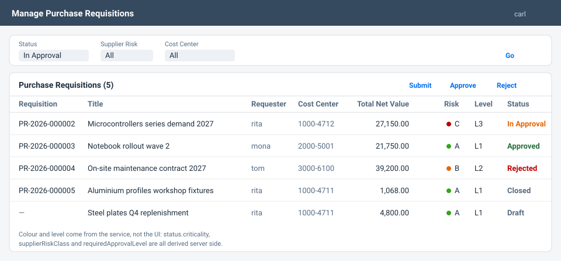
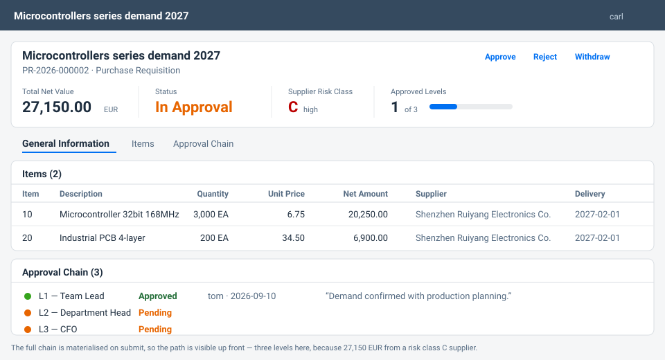
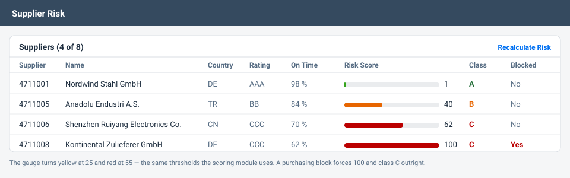

# Purchase Requisition Approval & Supplier Risk

**The same S/4HANA requirement, built twice: on-stack with ABAP Cloud / RAP and
side-by-side with SAP CAP on BTP — plus the written comparison of when to
choose which.**

Every SAP customer is asking the Clean Core question right now, and most answers
are slide decks. This repository answers it with two working implementations and
a decision record that names the trade-offs.

---

## The scenario

Procurement at a mid-size manufacturer. A requester raises a purchase
requisition; how many signatures it needs depends on its **value** and on how
**risky its suppliers** are. A supplier downgraded by the rating agency makes
every open requisition that uses it more expensive to approve, immediately.

That second half is what makes the scenario worth building: it forces master
data and transactional data to interact — which is where extension projects
actually get hard.

| Net value (EUR) | Risk A | Risk B | Risk C |
|---|:---:|:---:|:---:|
| below 5,000 | L1 | L1 | **L2** |
| 5,000 – 24,999 | L1 | **L2** | L2 |
| 25,000 – 99,999 | L2 | L2 | **L3** |
| 100,000 and above | L3 | L3 | L3 |

L1 = Team Lead · L2 = Department Head · L3 = CFO.
The full rule set is in [`docs/business-rules.md`](docs/business-rules.md).

---

## Run it

```bash
cd cap
npm install
npm start
```

Then, with any of the mocked users (`rita`, `tom`, `dana`, `carl`, `mona`,
empty password):

- <http://localhost:4004/purchase-requisitions/webapp/index.html> — Fiori
  Elements app, List Report + Object Page
- <http://localhost:4004/suppliers/webapp/index.html> — supplier risk
- <http://localhost:4004/procurement/> — the OData V4 service
- <http://localhost:4004/analytics/> — the reporting service

```bash
npm test         # 174 tests, type checked as they run
npm run typecheck
npm run lint     # ESLint with type aware rules
npm run build    # production build: cds build + tsc to gen/srv
npm run types    # regenerate the model types for your editor
```

[`docs/demo-walkthrough.md`](docs/demo-walkthrough.md) is a recorded run of the
service — every request and every response in it came out of the running
application, not out of an editor.

---

## What it looks like

> These are **schematics, not screenshots.** They are drawn to the real layout
> and filled with the actual sample data from `cap/db/data`, so the numbers and
> the colours are the ones the running service produces. Real screenshots need
> a browser that can reach the SAPUI5 CDN; the build environment this was
> written in cannot, and a mockup labelled as a screenshot would be a lie.
> Run `npm start` and the pages below are what you get.

### Manage Purchase Requisitions — List Report



**What you see:** the worklist, filtered by status. Five requisitions across
every lifecycle state, each with its net value, the worst supplier risk class
in the document, and the approval level that follows from the two.

**What it demonstrates:** nothing on this screen is computed in the UI. The
status colour comes from `status.criticality` in the code list, the risk class
is derived from the item suppliers, and the required level falls out of the
approval matrix — all server side, all covered by tests. The three toolbar
actions are `@UI.DataFieldForAction` entries that hide themselves unless the
selected requisition is in a status that allows them, so the UI never offers
something the service would reject.

### Purchase Requisition — Object Page



**What you see:** one requisition for 27,150 EUR. Four key figures in the
header, the items, and the full approval chain.

**What it demonstrates:** the chain is **materialised on submit**, so all three
levels are visible from the start rather than appearing one at a time. Three
levels, because 27,150 EUR sits in the 25k–100k tier *and* the supplier is risk
class C — the interaction between master data and document data that makes this
scenario worth building. The progress bar is a `UI.DataPoint` with
`Visualization: #Progress` against `requiredApprovalLevel`; the L1 comment is
what the approver typed into the bound action.

Edit an item and the header updates itself: a `@Common.SideEffects` annotation
tells the client that `quantity` and `unitPrice` affect `totalValue` and
`requiredApprovalLevel`, and a determination on the server actually recomputes
them. Raise the quantity far enough and the chain grows a level while you watch.

### Supplier Risk — List Report



**What you see:** the supplier master with the five risk indicators and the
resulting score.

**What it demonstrates:** the gauge thresholds (yellow at 25, red at 55) are the
same constants the scoring module uses — `RISK_CLASS_THRESHOLDS` in
`cap/srv/lib/risk-scoring.ts`, mirrored in `ZCL_PR_RISK_SCORING`. The blocked
supplier at the bottom scores 100 regardless of its other indicators, and a
requisition that uses it cannot be submitted at all (`PR005`).

`Recalculate Risk` is a bound action restricted to `ProcurementAdmin`; the
unbound `recalculateAllSupplierRisks` is the nightly job entry point and
reports how many scores actually changed.

### And if you prefer evidence over pictures

[`docs/demo-walkthrough.md`](docs/demo-walkthrough.md) is a recorded run of the
service — every request and every response in it came out of the running
application.

---

## What is in here

```
.
├── cap/     SAP CAP service (TypeScript) — runnable, tested, deployable
│   ├── db/      domain model, code lists, sample data
│   ├── srv/     services + the rule modules the handlers call
│   ├── app/     two Fiori Elements apps (annotations + manifests)
│   └── test/    163 tests
├── abap/    ABAP Cloud / RAP implementation of the same business object
│   └── src/     tables, CDS views, behaviour definitions, classes, 51 ABAP Unit tests
└── docs/    architecture, domain model, business rules, 7 ADRs, demo script
```

---

## The structural decision behind both

**Business rules live in classes that know nothing about the framework.**

| | on-stack | side-by-side |
|---|---|---|
| Rules | `ZCL_PR_APPROVAL_POLICY`, `ZCL_PR_RISK_SCORING` | `srv/lib/approval-policy.ts`, `srv/lib/risk-scoring.ts` |
| Plumbing | behaviour pool `ZBP_I_PR_REQUISITION` | `srv/procurement-service.ts` |
| Rule tests | 51 ABAP Unit, no database | 112 Jest, no database |

No `SELECT`, no `req`, no `MODIFY ENTITIES` in a rule class. They take plain
structures and return plain findings. Three things follow: the tests actually
get written and run in a second; the approval matrix is a table a procurement
lead can read; and the two implementations become comparable line by line —
which is what turns [ADR 0001](docs/adr/0001-onstack-vs-sidebyside.md) from an
opinion into evidence.

---

## Where to look

| If you want to see | Open |
|---|---|
| Whether I can reason about architecture | [`docs/adr/`](docs/adr/) — six decisions with their costs |
| Whether the business logic is any good | [`cap/srv/lib/approval-policy.ts`](cap/srv/lib/approval-policy.ts) |
| Whether I can write RAP | [`abap/src/behavior/zi_pr_requisition.bdef.asbdef`](abap/src/behavior/zi_pr_requisition.bdef.asbdef) |
| Whether I test properly | [`docs/testing.md`](docs/testing.md) |
| How I set up CAP with TypeScript | [ADR 0007](docs/adr/0007-typescript.md) |
| Whether it actually runs | [`docs/demo-walkthrough.md`](docs/demo-walkthrough.md) |
| A specific SAP skill | [`docs/skills-matrix.md`](docs/skills-matrix.md) |
| How I would present this | [`docs/demo-script.md`](docs/demo-script.md) |

---

## Four details worth a minute

**Draft events are different events.** In CAP, editing a draft fires `NEW` and
`PATCH` on the `.drafts` entity — not `CREATE`/`UPDATE` on the active one. A
determination registered only on the latter compiles, passes the API tests, and
does nothing at all in the Fiori object page. That bug happened during
development; the test `draft handling > walks create -> add item -> activate`
exists because of it. [ADR 0003](docs/adr/0003-draft-handling.md)

**A type system does not make money safe.** TypeScript's `number` is an IEEE 754
double, so `24999.999999999996` is an ordinary result
of a floating point multiplication and lands on the wrong side of a `< 25000`
threshold — roughly one requisition in a thousand silently takes the cheaper
approval path. Every amount comparison on the CAP side goes through integer
cents. On the ABAP side that helper does not exist, because packed numbers are
exact — and that asymmetry is documented so nobody adds it "for consistency".
[ADR 0004](docs/adr/0004-money-handling.md)

**A TypeScript service that silently has no handlers.** CAP only looks for a
`.ts` service implementation when `CDS_TYPESCRIPT` is set
(`@sap/cds/lib/srv/factory.js`). Without it the service starts, serves the
model, and answers `501` for every action. No compiler and no linter can see
this — only a test that calls an action. `cap/test/setup.ts` sets the flag and
the 38 integration tests are what proves it stayed set.
[ADR 0007](docs/adr/0007-typescript.md)

**Segregation of duties is a business rule, not a permission.** An approver may
well hold the right role — just not for a document they raised themselves. The
check sits in the rule module next to the approval matrix, not in the
authorisation layer. It is the first thing an auditor asks about.

---

## Scope, stated plainly

- The **CAP implementation runs and is tested on every commit.** Type
  generation, `tsc --noEmit`, type aware linting, a CDS compile, 174 tests with
  a coverage floor, and a production build that must actually emit the compiled
  service are all enforced by [CI](.github/workflows/ci.yml).
- **TypeScript is pinned to 6.0.3, not the latest 7.0.2.** `ts-jest` supports
  `<7` and `typescript-eslint` supports `<6.1`, so 6.0.3 is the newest version
  the whole toolchain carries. `npm outdated` will keep flagging it; that is the
  correct state, and the reasoning is in
  [ADR 0007](docs/adr/0007-typescript.md). Everything else is current and
  `npm audit` reports zero vulnerabilities.
- The **ABAP package is written for review, not for a one-click import.** There
  is no ABAP system in this pipeline, so it has not been activated as part of
  this repository. What CI *can* check without a system — object naming, no
  leftover debug statements, and that the message numbers of the two stacks have
  not drifted apart — it checks. Details in [`abap/README.md`](abap/README.md).
- **Document numbering is max-plus-one**, which is wrong under concurrency. The
  fix is named in [ADR 0005](docs/adr/0005-number-assignment.md). It is written
  down rather than hidden because the failure mode is silent.
- **No workflow engine, no eventing.** Both are scope decisions with their
  reasoning in [`docs/architecture.md`](docs/architecture.md), not oversights.
