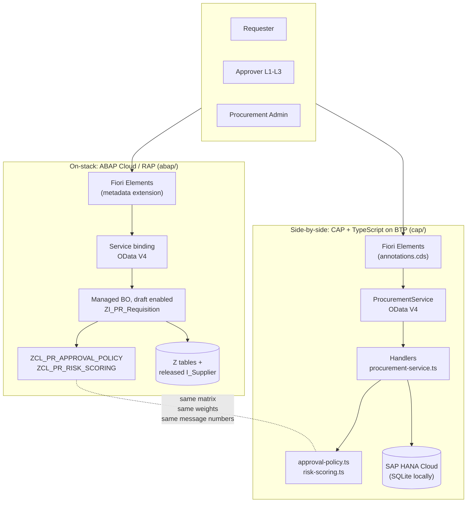

# Architecture

## The question this project answers

> A business department needs a purchase requisition approval with supplier
> risk scoring. Do you build it on-stack in S/4HANA, or side-by-side on BTP?

Most answers to that question are slide decks. This repository answers it with
two working implementations of the same requirement and a written comparison of
what each one costs.

## The scenario

Procurement at a mid-size manufacturer. A requester raises a purchase
requisition; how many signatures it needs depends on its value **and** on how
risky its suppliers are. A supplier downgraded by the rating agency must
immediately make the requisitions that use it more expensive to approve.

That second half is what makes the scenario worth building: it forces master
data and transactional data to interact, which is where extension projects
usually get hard.

## Both implementations at a glance

## The layering both sides share

The single most important structural decision in this repository is the same on
both stacks:

**The business rules live in classes that know nothing about the framework.**

| | on-stack | side-by-side |
|---|---|---|
| Rules | `ZCL_PR_APPROVAL_POLICY`, `ZCL_PR_RISK_SCORING` | `srv/lib/approval-policy.ts`, `srv/lib/risk-scoring.ts` |
| Plumbing | behaviour pool `ZBP_I_PR_REQUISITION` | `srv/procurement-service.ts` |
| Tests on the rules | 51 ABAP Unit tests, no database | 128 Jest tests, no database |
| Tests on the fixtures | - | 25 tests recomputing every derived value in `db/data` |
| Tests on the plumbing | - | 59 integration tests over HTTP |

The rule classes contain no `SELECT`, no `req`, no `MODIFY ENTITIES`. They take
plain structures and return plain findings. Three things follow from that:

1. They are testable in milliseconds, so the tests actually get written.
2. They can be read by a business analyst who does not know either framework.
3. The two implementations can be compared line by line - which is what makes
   the Clean Core discussion in [`adr/0001`](adr/0001-onstack-vs-sidebyside.md)
   concrete rather than theoretical.

## What the CAP side has on top

The side-by-side implementation carries the parts a customer demo needs, and
they have no ABAP counterpart (see the parity note in
[`business-rules.md`](business-rules.md)):

| Building block | Where | What it does |
|---|---|---|
| Approver inbox | `MyApprovalTasks` + `app/approvals` | Requisitions waiting for exactly the calling user's level. The filter (pending level, roles, segregation of duties) is pushed into the database query; approve and reject are bound actions on the same projection. |
| Audit trail | `RequisitionEvents` | Append-only history per requisition, written by the service only. Includes adjustments nobody clicked. |
| Risk propagation | `reassessApprovalPath()` | A risk change re-derives the approval path of open requisitions ([`adr/0008`](adr/0008-risk-changes-never-shorten-the-path.md)). |
| S/4HANA integration | `srv/external`, `srv/lib/s4-mapping.ts` | Supplier master data in, purchase orders out, through released OData APIs ([`adr/0009`](adr/0009-s4-integration-via-released-apis.md)). |
| Cockpit | `app/cockpit.html` | Volume, risk exposure, budget utilisation and recent activity, read from the reporting service. |
| Shell, tour, demo mode | `app/shared` | ShellBar with language, theme and user switch, onboarding tour, demo script, `resetData`. |

**Demo mode is fenced off.** One-click user switching writes a cookie that
`srv/demo-mode.ts` turns into mocked credentials, and `DemoService` refuses
every call unless `cds.requires.auth.kind` is `mocked` or `basic`. With
XSUAA/IAS - i.e. in any productive landscape - both are inert.

## Authorisation

Five roles, identical on both stacks:

| Role | May |
|------|-----|
| `Requester` | create, edit, submit and withdraw own requisitions |
| `ApproverL1` | approve up to the first threshold |
| `ApproverL2` | approve up to the second threshold |
| `ApproverL3` | approve everything |
| `ProcurementAdmin` | maintain supplier master data, run the risk recalculation, update ratings, sync suppliers from S/4HANA |

Three mechanisms carry it:

- **Static**, per entity and operation - `@requires` / `@restrict` in CAP,
  `authorization master ( global )` in RAP.
- **Instance based** - `MyRequisitions` pushes `requester = $user` into the
  database query; RAP does the same in `get_instance_authorizations`.
- **In the rule** - the segregation of duties check lives in
  `validateDecision` / `VALIDATE_DECISION`, not in the authorisation layer,
  because "you may approve, but not this one" is a business rule, not a
  permission.

Feature control (greyed out buttons) is deliberately **not** in that list. It
calls the same predicate, but every action re-evaluates the rule itself. A
disabled button is a courtesy to the user, never a security boundary.

## Deployment

The CAP side is a standard MTA: a Node.js module running the compiled
TypeScript service, an HDI
deployer for the HANA artefacts, XSUAA for authentication.
[`mta.yaml`](../cap/mta.yaml) and [`xs-security.json`](../cap/xs-security.json)
are the real descriptors, and `npm run build` produces the `gen/` folders they
reference. See [`adr/0006`](adr/0006-deployment-topology.md) for what is
deliberately simplified.

The ABAP side is transported the usual way; what has to be created in the
system rather than pulled from git is listed in
[`../abap/README.md`](../abap/README.md).

## What is deliberately missing

- **A workflow engine.** The approval chain is a state machine in the
  application, not SAP Build Process Automation. For three levels and one
  decision per level that is the cheaper answer; the moment the chain needs
  deadlines, substitutions or parallel approvers, it stops being the right one.
- **Eventing.** An approved requisition should raise an event that a purchase
  order consumer subscribes to. The `close` action is where that would hook in.
- **Approval cycle time reporting.** It needs a timestamp difference, which is
  written differently on SQLite and HANA; the analytics views stay portable
  instead.

Each of these is a scope decision, not an oversight.
