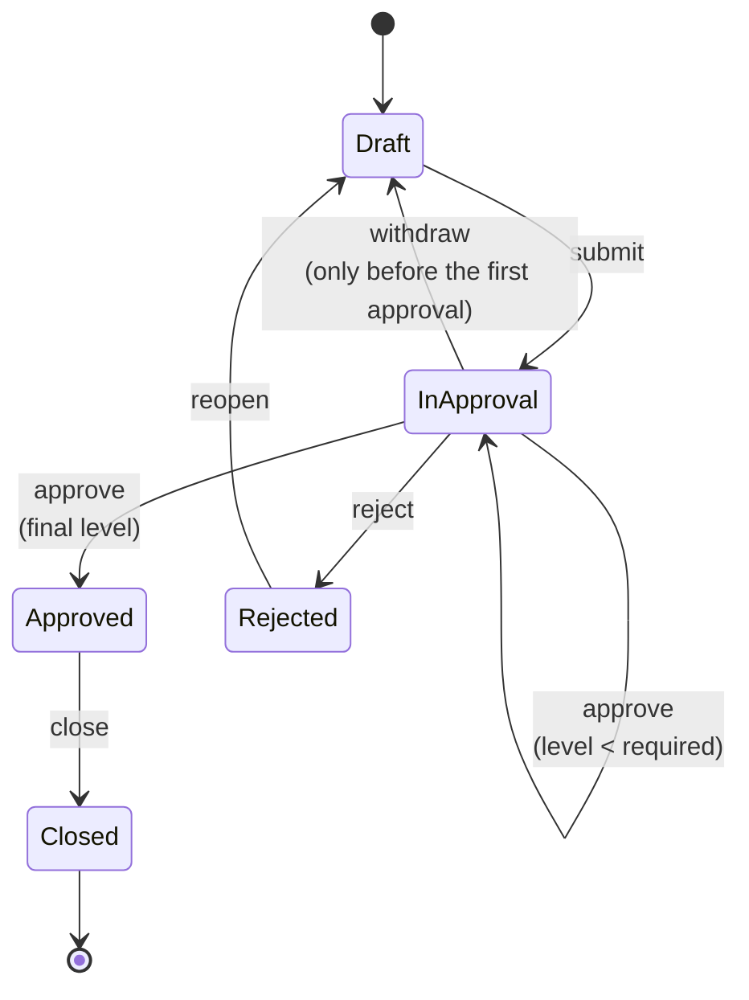

# Business rules

This is the document a procurement lead reads and signs off. Every rule here is
implemented twice and tested twice; the file references tell you where.

## 1. Approval matrix

How many signatures a requisition needs, by net value and by the worst supplier
risk class in the document:

| Net value (EUR) | Risk A (low) | Risk B (medium) | Risk C (high) |
|---|:---:|:---:|:---:|
| below 5,000 | L1 | L1 | **L2** |
| 5,000 – 24,999 | L1 | **L2** | L2 |
| 25,000 – 99,999 | L2 | L2 | **L3** |
| 100,000 and above | L3 | L3 | L3 |

| Level | Who | Role |
|---|---|---|
| L1 | Team Lead | `ApproverL1` / `ZPR_APPROVER_L1` |
| L2 | Department Head | `ApproverL2` / `ZPR_APPROVER_L2` |
| L3 | CFO | `ApproverL3` / `ZPR_APPROVER_L3` |

Approval is **cumulative**: a requisition that needs L3 is approved by L1, then
L2, then L3. The chain is materialised on submit, so the object page shows the
whole path up front instead of revealing it one step at a time.

Two properties are asserted by tests rather than left to good intentions:

- **A riskier supplier is never cheaper to approve.** For every value, L(C) ≥
  L(B) ≥ L(A).
- **A more expensive requisition is never cheaper to approve.** For every risk
  class, the level never drops as the value grows.

An unassessed supplier counts as **medium** risk - not knowing must not be the
cheap option.

> Implemented in `cap/srv/lib/approval-policy.ts` → `APPROVAL_MATRIX` and
> `abap/src/classes/zcl_pr_approval_policy.clas.abap` → `APPROVAL_MATRIX( )`.
> Boundaries are exclusive; 4,999.99 EUR is still the cheaper tier.

## 2. Supplier risk score

A weighted score from 0 (no concerns) to 100 (do not order here):

| Indicator | Weight | 0 points | 100 points | Source |
|---|---:|---|---|---|
| Financial rating | 40 % | AAA | D | rating agency feed |
| On time delivery rate | 25 % | 100 % on time | 0 % on time | purchase order history |
| Quality incidents (12 months) | 20 % | none | 8 or more | QM notifications Q2/Q3 |
| Country risk | 10 % | OECD category 0 | highest category | compliance |
| ISO 9001 certification | 5 % | certified | not certified | supplier self disclosure |

| Score | Risk class |
|---|---|
| 0 – 24 | **A** low |
| 25 – 54 | **B** medium |
| 55 – 100 | **C** high |

**A purchasing block overrules everything.** A blocked supplier scores 100 and
lands in class C regardless of its indicators - and a requisition that uses one
cannot be submitted at all.

**Missing data is never rewarded.** An unrated supplier is scored like a `B`
rating (50 points), an unknown country like 50 points, a supplier without
delivery history like 80 % on time. An incomplete profile can never score
better than a complete one - that property has its own test on both stacks.

A requisition inherits the **worst** risk class of all its item suppliers. One
bad supplier in one item raises the approval level for the whole document.

> `cap/srv/lib/risk-scoring.ts` and
> `abap/src/classes/zcl_pr_risk_scoring.clas.abap`.

## 3. Submit validations

All of them are checked at once; the requester gets one list, not one error per
round trip.

| Code | Rule |
|---|---|
| `PR001` | A requisition must contain at least one item. |
| `PR002` | Every item needs a quantity greater than zero. |
| `PR003` | A unit price must not be negative. |
| `PR004` | A delivery date must not be in the past (today is allowed). |
| `PR005` | No item may use a supplier with a purchasing block. |
| `PR006` | The requisition must fit into the remaining cost center budget. |
| `PR007` | A requisition needs a title. |
| `PR012` | A requisition needs a cost center. |

The budget check compares against `annual budget − consumed budget`. Spending
the remainder **to the last cent is allowed**; one cent more is not. Cost
centers without a maintained budget are not checked.

## 4. Decision validations

| Code | Rule |
|---|---|
| `PR008` | Nobody decides on a requisition they raised themselves. |
| `PR009` | The action must be allowed in the current status. |
| `PR010` | The approver needs the role of the level that is pending. |
| `PR011` | A completed approval chain accepts no further decisions. |

`PR008` is **segregation of duties** and it is checked against both the
requester and the creator, so raising a requisition "on behalf of" someone else
does not open a back door. It is deliberately a business rule rather than an
authorisation check: the user may well hold the approver role - just not for
this document.

## 5. Lifecycle

Everything not drawn here is refused with `PR009`. `Closed` is a dead end -
there is a test that walks every action against a closed requisition and
expects all of them to fail.

**Withdrawing is only possible while nobody has signed off.** Once L1 has
approved, the requester cannot quietly pull the document back and change it.

## 6. Side effects of an approval

The moment the **last** signature is given:

1. the status becomes `Approved` and `completedAt` is stamped,
2. the requisition value is added to the cost center's consumed budget.

The budget is committed at the last signature and not when the purchase order
is created. Otherwise two requisitions could both pass the budget check against
the same remaining amount and both be approved.

## 7. Document numbers

`PR-<year>-<6 digits>`, assigned on submit, kept on resubmission. A rejected and
reworked requisition keeps its number; a copy gets a new one.

> The demo implementation reads the current maximum. A productive one uses a
> number range object - see [`adr/0005`](adr/0005-number-assignment.md).
