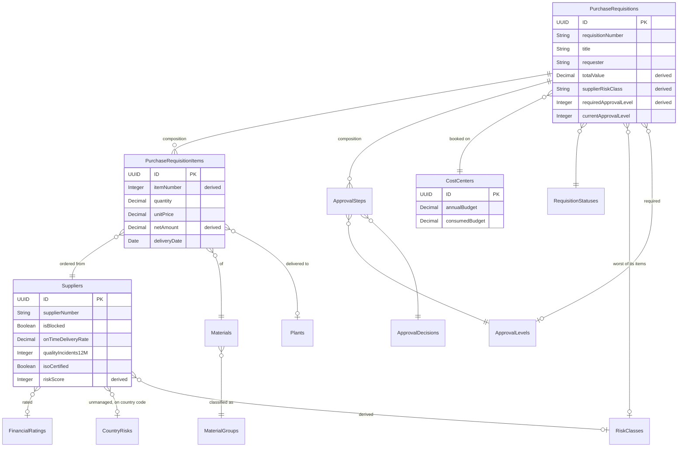

# Domain model



## Derived fields

Six fields are never written by a client. They are maintained by
determinations and recomputed from their inputs on every relevant change:

| Field | Derived from | Where |
|---|---|---|
| `PurchaseRequisitionItems.itemNumber` | position in the document (10, 20, 30 ...) | item determination |
| `PurchaseRequisitionItems.netAmount` | `quantity * unitPrice`, rounded once | item determination |
| `PurchaseRequisitions.totalValue` | sum of item net amounts | header determination |
| `PurchaseRequisitions.supplierRiskClass` | worst risk class of all item suppliers | header determination |
| `PurchaseRequisitions.requiredApprovalLevel` | approval matrix over the two above | header determination |
| `Suppliers.riskScore` / `riskClass` | the five risk indicators | `recalculateRisk` |

`submit` recomputes all of them from the persisted items before validating -
items can be changed through a channel that does not run the determination (an
interface, a data migration, a mass update), and submitting is the point where
the document has to be internally consistent.

## The one modelling decision worth discussing

`Suppliers.countryRisk` is an **unmanaged** association:

```cds
countryRisk : Association to CountryRisks on countryRisk.code = country.code;
```

There is no foreign key column - the country code is the join key. The
alternative, a managed association with its own `countryRisk_ID`, would mean two
fields that must agree about which country the supplier is in.

This also fixed a real bug during development. `CountryRisks` started out as a
table nothing pointed at, so CAP's model optimisation dropped it from the
runtime model and `recalculateAllSupplierRisks` failed with a confusing
`Cannot read properties of undefined`. Making the relationship explicit both
fixed it and removed two database round trips per supplier, because the scoring
handler now resolves the rating and the country risk with expands in a single
query.

## Where the ABAP model differs

Deliberately, in one place. `Suppliers` on the CAP side is a full table,
because a side-by-side extension has no direct access to the S/4 supplier
master. On the ABAP side there is only `ZPR_SUP_RISK`, holding the five risk
attributes, joined to the released `I_Supplier` for name, country and the
purchasing block.

That difference is not an inconsistency - it *is* the cost of side-by-side
extensibility, made visible in the data model. See
[ADR 0001](adr/0001-onstack-vs-sidebyside.md).
